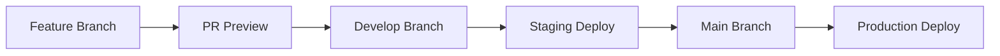

# 🔄 CI/CD Workflows & Deployment Pipelines Guide

This document explains the comprehensive CI/CD workflows and deployment pipelines we've set up for the JobTrack application. Understanding these workflows will give you insights into modern DevOps practices and automated deployment strategies.

## 📋 Overview

Our CI/CD setup consists of three main workflows:

1. **🔍 Continuous Integration (CI)** - Code quality, testing, and validation
2. **🚀 Continuous Deployment (CD)** - Automated deployments to different environments  
3. **👀 PR Preview Deployments** - Temporary deployments for testing pull requests

## 🔍 Continuous Integration Pipeline

### File: `.github/workflows/ci.yml`

**Trigger:** Every push and pull request to `main` or `develop` branches

### Pipeline Stages

#### 1. **Code Quality & Linting** 📝
```yaml
- ESLint for JavaScript/TypeScript
- Code style consistency checks
- Security audit (npm audit)
```

**Purpose:** Ensures code follows established standards and is free from basic security vulnerabilities.

#### 2. **Unit Tests** 🧪
```yaml
- React component tests
- Function unit tests
- Coverage reporting
```

**Purpose:** Validates individual components work correctly in isolation.

#### 3. **Build Applications** 🏗️
```yaml
- Build React frontend
- Compile TypeScript functions
- Generate production artifacts
```

**Purpose:** Ensures the application can be successfully built for deployment.

#### 4. **Firebase Rules Validation** 🔥
```yaml
- Validate Firestore security rules
- Check rule syntax and logic
```

**Purpose:** Prevents deployment of broken security rules that could expose data.

#### 5. **Integration Tests** 🔗
```yaml
- Start Firebase emulators
- Test API endpoints
- End-to-end functionality tests
```

**Purpose:** Validates that different parts of the application work together correctly.

#### 6. **Security Scanning** 🔒
```yaml
- CodeQL analysis
- Dependency vulnerability scanning
- SARIF reporting
```

**Purpose:** Identifies potential security vulnerabilities in code and dependencies.

#### 7. **Performance Testing** ⚡
```yaml
- Bundle size analysis
- Lighthouse CI tests
- Performance budgets
```

**Purpose:** Ensures the application meets performance standards.

### Key Concepts

**Parallel Execution:** Multiple jobs run simultaneously to reduce pipeline time.

**Dependency Management:** Jobs use `needs:` to create dependencies between stages.

**Artifact Sharing:** Build artifacts are shared between jobs using `upload-artifact` and `download-artifact`.

**Matrix Builds:** Could be extended to test across multiple Node.js versions.

## 🚀 Continuous Deployment Pipeline

### File: `.github/workflows/deploy.yml`

**Trigger:** Successful completion of CI pipeline on `main` or `develop` branches

### Environment Strategy

| Branch | Environment | Purpose |
|--------|-------------|---------|
| `main` | Production | Live application for users |
| `develop` | Staging | Testing environment for QA |
| `feature/*` | Preview | Temporary review environments |

### Deployment Stages

#### 1. **Environment Setup** 🎯
```yaml
- Determine target environment
- Set project configuration
- Configure environment variables
```

**Dynamic Environment Selection:** The pipeline automatically determines whether to deploy to production, staging, or preview based on the branch.

#### 2. **Pre-deployment Checks** ✅
```yaml
- Verify Firebase authentication
- Check project access
- Validate deployment requirements
```

**Safety First:** Ensures all prerequisites are met before deployment begins.

#### 3. **Build for Deployment** 🏗️
```yaml
- Install dependencies
- Set environment variables
- Build applications with production config
- Create deployment artifacts
```

**Environment-Specific Builds:** Different configuration for each environment.

#### 4. **Deploy Functions** ⚡
```yaml
- Deploy Cloud Functions
- Update function configuration
- Verify deployment success
```

**Serverless Backend:** Firebase Functions provide the API layer.

#### 5. **Deploy Firestore Rules** 🗄️
```yaml
- Update database security rules
- Deploy indexes
- Validate rule deployment
```

**Data Security:** Ensures database access rules are properly configured.

#### 6. **Deploy Frontend** 🌐
```yaml
- Deploy to Firebase Hosting
- Update routing configuration
- Get deployment URL
```

**Static Site Hosting:** Optimized delivery of the React application.

#### 7. **Post-deployment Tests** 🧪
```yaml
- Health checks
- Smoke tests
- Performance validation
```

**Deployment Verification:** Ensures the deployed application is working correctly.

#### 8. **Notifications** 📢
```yaml
- Success/failure notifications
- Slack integration
- Deployment summaries
```

**Team Communication:** Keeps the team informed about deployment status.

### Advanced Features

**Blue-Green Deployments:** Could be implemented using Firebase Hosting channels.

**Rollback Strategy:** Firebase provides automatic rollback capabilities.

**Environment Promotion:** Code flows from feature → staging → production.

## 👀 PR Preview Deployments

### File: `.github/workflows/pr-preview.yml`

**Trigger:** Pull request opened, updated, or closed

### Preview Strategy

**Temporary Environments:** Each PR gets its own isolated environment.

**Automatic Cleanup:** Environments are destroyed when PRs are closed.

**Performance Testing:** Lighthouse tests run on every preview.

### Preview Workflow

#### 1. **Deploy Preview** 🚀
```yaml
- Build application for preview
- Deploy to unique Firebase channel
- Generate preview URL
```

**Isolated Testing:** Each PR has its own URL for testing changes.

#### 2. **Run Tests** 🧪
```yaml
- Health checks on preview URL
- Lighthouse performance tests
- Accessibility validation
```

**Quality Assurance:** Ensures changes don't break functionality or performance.

#### 3. **PR Comments** 💬
```yaml
- Auto-comment with preview URL
- Include test results
- Provide testing instructions
```

**Developer Experience:** Makes it easy for reviewers to test changes.

#### 4. **Cleanup** 🧹
```yaml
- Delete preview channel when PR closes
- Free up resources
- Update PR with cleanup status
```

**Resource Management:** Prevents accumulation of unused preview environments.

### Security Considerations

**External PRs:** Additional security checks for contributions from forks.

**Secrets Management:** Limited access to sensitive environment variables.

**Review Requirements:** Manual approval required for external contributions.

## 🔧 Configuration Files

### Pipeline Configuration

#### `.lighthouserc.json`
```json
{
  "ci": {
    "assert": {
      "assertions": {
        "categories:performance": ["warn", {"minScore": 0.8}],
        "categories:accessibility": ["error", {"minScore": 0.9}]
      }
    }
  }
}
```

**Performance Budgets:** Automatically fails builds that don't meet performance standards.

#### Root `package.json`
```json
{
  "workspaces": ["functions", "frontend"],
  "scripts": {
    "dev": "concurrently \"npm run dev:emulators\" \"npm run dev:frontend\""
  }
}
```

**Monorepo Management:** Coordinates multiple packages in a single repository.

## 🔒 Secrets Management

### Required GitHub Secrets

| Secret | Purpose | Environment |
|--------|---------|-------------|
| `FIREBASE_TOKEN` | Deploy to Firebase | All |
| `GOOGLE_CLIENT_ID` | OAuth configuration | All |
| `GOOGLE_CLIENT_SECRET` | OAuth configuration | All |
| `REACT_APP_FIREBASE_*` | Frontend configuration | All |
| `SLACK_WEBHOOK` | Notifications | Production |

### Security Best Practices

**Least Privilege:** Each environment has only the secrets it needs.

**Rotation:** Secrets should be rotated regularly.

**Audit Trail:** All secret usage is logged in GitHub Actions.

## 📊 Monitoring & Observability

### Pipeline Metrics

**Build Times:** Track how long each stage takes.

**Success Rates:** Monitor deployment success/failure rates.

**Test Coverage:** Ensure code coverage doesn't decrease.

### Application Monitoring

**Firebase Analytics:** User behavior and performance metrics.

**Error Tracking:** Automatic error reporting and alerting.

**Performance Monitoring:** Real-time performance metrics.

## 🚀 Advanced Pipeline Patterns

### GitFlow Integration



### Deployment Gates

**Manual Approval:** Production deployments require manual approval.

**Automated Testing:** Comprehensive test suite must pass.

**Security Scanning:** No high-severity vulnerabilities allowed.

### Rollback Strategy

**Automatic Rollback:** Failed health checks trigger automatic rollback.

**Manual Rollback:** One-click rollback to previous version.

**Database Migrations:** Separate pipeline for database schema changes.

## 🎯 Best Practices Implemented

### Development Workflow

1. **Feature Branches:** All work done in feature branches
2. **PR Reviews:** Code must be reviewed before merging
3. **Automated Testing:** Comprehensive test coverage
4. **Preview Environments:** Test changes before merging

### Deployment Strategy

1. **Environment Parity:** All environments configured similarly
2. **Infrastructure as Code:** All configuration in version control
3. **Automated Deployments:** No manual deployment steps
4. **Monitoring:** Comprehensive monitoring and alerting

### Security Practices

1. **Secrets Management:** All secrets stored securely
2. **Access Control:** Limited access to production environments
3. **Audit Logging:** All actions logged and traceable
4. **Security Scanning:** Automated vulnerability detection

## 🔧 Customization Guide

### Adding New Environments

1. Create new Firebase project
2. Add environment secrets to GitHub
3. Update workflow environment mapping
4. Configure environment-specific settings

### Adding New Tests

1. Add test scripts to appropriate package.json
2. Update CI workflow to run new tests
3. Configure test result reporting
4. Set up failure notifications

### Integrating New Tools

1. Add tool configuration files
2. Update workflow with new steps
3. Configure result reporting
4. Document usage in README

## 🎓 Learning Outcomes

By studying and working with these workflows, you'll learn:

### CI/CD Concepts
- **Pipeline Design:** How to structure automated workflows
- **Environment Management:** Handling multiple deployment environments
- **Testing Strategy:** Comprehensive automated testing approaches
- **Security Integration:** Building security into the development process

### DevOps Practices
- **Infrastructure as Code:** Managing infrastructure through version control
- **Monitoring & Alerting:** Observability in automated systems
- **Incident Response:** Handling deployment failures and rollbacks
- **Team Collaboration:** Coordinating development across team members

### Tools & Technologies
- **GitHub Actions:** Advanced workflow automation
- **Firebase Platform:** Serverless application deployment
- **Testing Frameworks:** Automated testing strategies
- **Security Tools:** Vulnerability scanning and security analysis

This comprehensive CI/CD setup provides a production-ready foundation for modern web application development and deployment! 🚀 